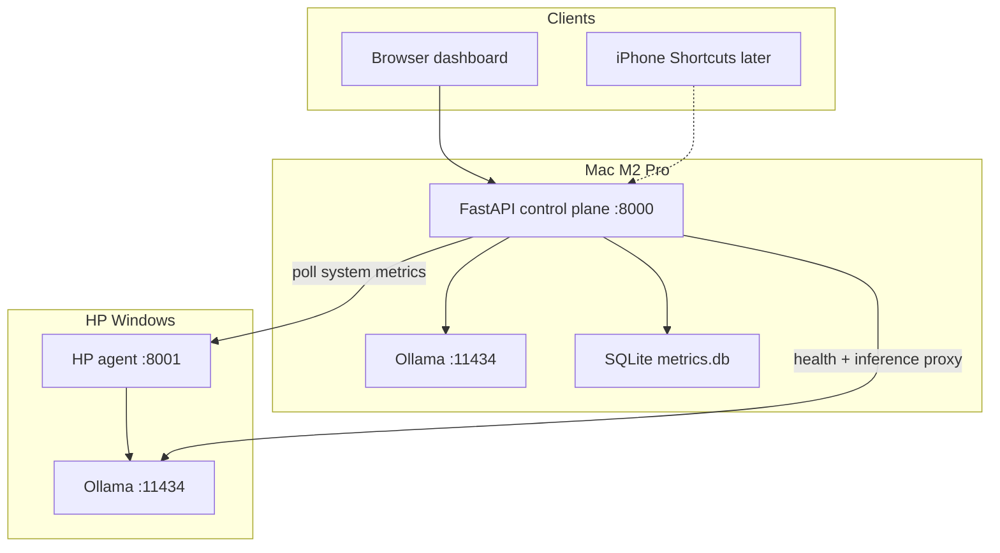
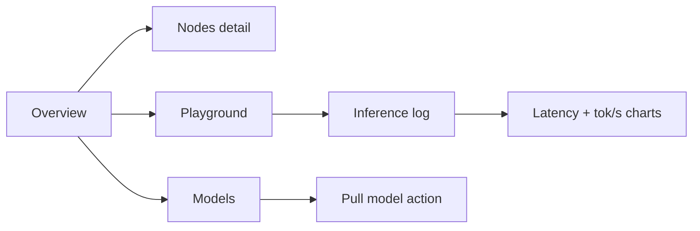

# Home Lab Infrastructure + Dashboard Plan

## Goal

Build the **control plane** for your two-node home lab: Mac M2 Pro and HP Ultra 7 — both are **peer inference nodes** (each can run fast or heavy models). The Mac hosts the orchestrator; routing can be **automatic** (orchestrator picks the best node) or **manual** (you pick node + model from the dashboard). Ollama is already running on both — this plan adds the glue layer, metrics, model registry, and a React dashboard. No new inference runtime; we integrate with Ollama's existing HTTP API.

## Architecture



**Data flow for inference (two modes):**

**Manual mode** — user picks node + model explicitly (dashboard Playground or API):
1. Client sends `{ model, prompt, node: "mac" | "hp" }` — no ambiguity
2. API validates the model exists on that node, proxies to its Ollama, logs metrics

**Auto mode** — orchestrator decides:
1. Client sends `{ model, prompt, node: "auto" }` (or omits `node`)
2. Router scores both nodes: model installed?, RAM headroom, current load, historical tokens/sec for that model on that node
3. Picks the best available node; logs which node was chosen and why (stored in `routing_reason` column)

Both modes proxy to Ollama `/api/generate` or `/api/chat` and write to `inference_logs`.

## Repository layout

Greenfield repo ([`README.md`](README.md) is empty today). Proposed structure:

```
Home-Lab/
├── config/
│   ├── nodes.yaml          # Mac + HP URLs (from .env overrides)
│   └── models.yaml         # Model catalog + default node routing
├── services/
│   ├── api/                # FastAPI control plane (runs on Mac)
│   │   ├── app/
│   │   │   ├── main.py
│   │   │   ├── config.py
│   │   │   ├── db.py
│   │   │   ├── routers/    # health, nodes, models, inference, metrics
│   │   │   └── services/   # ollama_client, router, metrics_collector
│   │   └── pyproject.toml
│   └── agent/              # Lightweight FastAPI sidecar (runs on HP)
│       ├── app/
│       │   ├── main.py
│       │   └── collectors/ # psutil + Ollama /api/ps
│       └── pyproject.toml
├── dashboard/              # React + Vite + TypeScript
│   ├── src/
│   │   ├── api/            # typed fetch client
│   │   ├── pages/          # Overview, Models, Playground, Inference, Nodes
│   │   └── components/     # StatCard, NodeStatus, LatencyChart
│   └── package.json
├── scripts/
│   ├── start-api.sh
│   ├── start-agent.ps1
│   └── pull-models.sh      # pull models to both nodes from models.yaml
├── data/                   # gitignored — SQLite lives here
├── .env.example
└── README.md               # setup + LAN verification steps
```

## Technology choices

| Layer | Choice | Rationale |
|---|---|---|
| Control plane | **Python 3.11+ / FastAPI / uvicorn** | Matches future app pipelines (grocery, RAG); easy Ollama HTTP proxy |
| HP sidecar | **FastAPI (minimal)** | Same stack, exposes local psutil + Ollama stats Mac can't see directly |
| Metrics store | **SQLite** | Zero ops for personal lab; upgrade to Postgres later if needed |
| HTTP client | **httpx** (async) | Clean async proxy to Ollama on both nodes |
| Dashboard | **React + Vite + TypeScript** | Your preference; long-term UI flexibility |
| Dashboard data | **TanStack Query** (polling every 5s) | Simple live updates without WebSockets in v1 |
| Charts | **Recharts** | Lightweight, good for latency/tokens-over-time |
| Styling | **Tailwind CSS** | Fast, consistent dashboard UI |
| Config | **`.env` + YAML** | Secrets/IPs in `.env`; model routing rules in git-tracked YAML |
| Package mgmt | **uv** or **pip + venv** per service | Single `pyproject.toml` per Python service |

**Explicitly out of scope for v1:** Docker, Kubernetes, Redis, Prometheus/Grafana, MLX second runtime, Tailscale (documented as optional follow-up).

## Core API endpoints (Mac control plane)

| Endpoint | Purpose |
|---|---|
| `GET /api/v1/health` | API alive |
| `GET /api/v1/nodes` | Mac + HP status (online, latency, RAM, CPU, Ollama version) |
| `GET /api/v1/models` | Aggregated model list from both Ollamas |
| `POST /api/v1/models/pull` | Trigger pull on a specific node |
| `POST /api/v1/inference` | Generate/chat with explicit `node` + `model`, or `node: auto` for orchestrator routing |
| `GET /api/v1/models/available` | Models grouped by node (for Playground dropdowns) |
| `POST /api/v1/routing/preview` | Dry-run auto routing — returns which node would be picked and why, without running inference |
| `GET /api/v1/metrics/summary` | Fleet totals (requests today, avg tokens/sec) |
| `GET /api/v1/metrics/inference` | Paginated inference history + filters |
| `GET /api/v1/metrics/timeseries` | Aggregated latency/tokens-per-sec for charts |

## HP agent endpoints (Windows)

| Endpoint | Purpose |
|---|---|
| `GET /health` | Agent alive |
| `GET /metrics` | `{cpu_percent, ram_used_gb, ram_total_gb, ollama_loaded_model, ollama_vram?}` |
| `GET /ollama/ps` | Pass-through of local Ollama process list |

Mac collects its own local metrics inline (psutil); HP metrics come from the agent.

## Model routing ([`config/models.yaml`](config/models.yaml))

Both nodes are **peer inference targets**. YAML defines catalog + preferences, not hard locks — the same model can be installed on both machines.

```yaml
nodes:
  mac:
    tags: [apple_silicon, mlx_friendly]
    strengths: [low_latency]       # faster tokens/sec for small/mid models
  hp:
    tags: [high_ram]
    strengths: [large_models]      # 27B+ fits comfortably; also runs 8B fine

models:
  - name: qwen3:8b
    preferred_node: mac            # hint for auto mode, not a restriction
    also_on: [hp]                  # optional — pull to both
    tags: [fast, general]
  - name: nemotron:14b
    preferred_node: mac
    tags: [reasoning]
  - name: qwen3:27b
    preferred_node: hp
    tags: [reasoning, large]

routing:
  auto:
    strategy: score                # pick highest-scoring available node
    factors:
      - model_installed            # must exist on node (hard requirement)
      - ram_headroom               # skip node if RAM > 85% used
      - preferred_node             # tie-breaker from models.yaml
      - historical_tokens_per_sec  # prefer faster node for same model if both have it
    fallback: any_available        # if preferred node offline, use the other
```

**Auto routing logic (orchestrator):**
1. Filter nodes where model is installed and node is online
2. Drop nodes with RAM > 85% (configurable threshold)
3. Score remaining: `preferred_node` match (+10), higher RAM headroom (+0–5), better historical tokens/sec for this model (+0–5)
4. Return winner + human-readable `routing_reason` (e.g. `"hp: only node with qwen3:27b installed"` or `"mac: preferred_node, 2.4x faster tok/s for qwen3:8b"`)

**Manual routing (dashboard Playground):**
- Node dropdown: Mac | HP | Auto
- Model dropdown: dynamically filtered to models installed on the selected node (or all models when Auto)
- Shows live node stats (RAM, loaded model) beside each dropdown so the choice is informed

`pull-models.sh` reads this file; respects `also_on` to pull the same model to multiple nodes when desired.

## Dashboard pages (React)



1. **Overview** — fleet status cards (Mac/HP online, current loaded model, RAM bars, requests today)
2. **Nodes** — per-node detail: CPU/RAM history sparkline, Ollama version, last seen
3. **Models** — table of installed models per node; "Pull" button calls API; shows which models exist on both nodes
4. **Playground** — interactive inference UI: pick **node** (Mac / HP / Auto) + **model** (filtered by node), enter prompt, run, see streaming response + live tokens/sec; routing reason shown when Auto is selected
5. **Inference** — searchable log table + charts (p50 latency, tokens/sec by model/node); filter by node to compare Mac vs HP on the same model

Dark theme by default (fits "lab" aesthetic); responsive for phone browser access on LAN.

## Configuration and LAN prerequisites

Since Ollama is already running, the plan includes a **verification checklist** in README rather than Ollama install steps:

- HP Ollama bound to `0.0.0.0:11434` (not just localhost) with Windows firewall rule
- HP agent on `:8001` similarly reachable from Mac
- [`.env.example`](.env.example) documents required vars:

```bash
MAC_OLLAMA_URL=http://127.0.0.1:11434
HP_OLLAMA_URL=http://<hp-lan-ip>:11434
HP_AGENT_URL=http://<hp-lan-ip>:8001
API_HOST=0.0.0.0
API_PORT=8000
DATABASE_PATH=./data/homelab.db
CORS_ORIGINS=http://localhost:5173
```

## Database schema (SQLite)

Two tables for v1:

- **`inference_logs`** — `id, timestamp, node, model, routing_mode (manual|auto), routing_reason, prompt_tokens, completion_tokens, latency_ms, tokens_per_sec, status, error`
- **`node_snapshots`** — periodic health polls: `timestamp, node, cpu_percent, ram_used_mb, ram_total_mb, ollama_loaded_model`

Retention: keep all rows for now (personal lab); add 90-day prune script later if needed.

## Implementation phases

### Phase 1 — Python scaffold + config
- Add monorepo structure, `.env.example`, extend [`.gitignore`](.gitignore) for `data/`, `node_modules/`, `.env`
- FastAPI app skeleton with CORS for Vite dev server
- Config loader (env + YAML)

### Phase 2 — Ollama integration + node health
- `OllamaClient` wrapping `/api/tags`, `/api/ps`, `/api/generate`, `/api/chat`, `/api/pull`
- Node health checker: parallel ping Mac Ollama + HP Ollama + HP agent
- `GET /api/v1/nodes` and `GET /api/v1/models`

### Phase 3 — Inference router + metrics logging
- Router service with two modes: explicit `node=mac|hp` (manual) and `node=auto` (scored pick)
- `POST /api/v1/routing/preview` for dry-run routing explanation
- `POST /api/v1/inference` with `{model, prompt, node?, stream?}` — validates model exists on chosen node
- `GET /api/v1/models/available` — models grouped by node for Playground dropdowns
- Background task: poll node metrics every 30s into `node_snapshots`

### Phase 4 — HP agent (Windows)
- Minimal FastAPI app with psutil + Ollama `/api/ps` passthrough
- `start-agent.ps1` for one-command launch
- Document Windows firewall + autostart (Task Scheduler) in README

### Phase 5 — React dashboard
- Vite + React + TS + Tailwind scaffold in [`dashboard/`](dashboard/)
- Typed API client pointing at `http://localhost:8000`
- Five pages: Overview, Nodes, Models, **Playground**, Inference — wired with 5s polling on status pages
- Playground: node selector + model selector (cross-filtered), prompt input, streaming response, routing reason badge
- Recharts for latency and tokens/sec over time; node comparison filter on Inference page

### Phase 6 — Model management + docs
- `pull-models.sh` driven by [`config/models.yaml`](config/models.yaml)
- Seed with your known models (Qwen3 8B, Nemotron 14B, Qwen3 27B)
- README: architecture diagram, start commands, LAN troubleshooting, "ready for projects" checklist

## How you'll run it day-to-day

**Mac (always on when lab is active):**
```bash
./scripts/start-api.sh          # FastAPI on :8000
cd dashboard && npm run dev     # React on :5173 (dev) or npm run build + serve static from API (prod)
```

**HP (always on when lab is active):**
```powershell
.\scripts\start-agent.ps1       # Agent on :8001; Ollama already running
```

**Pull models once infra is up:**
```bash
./scripts/pull-models.sh
```

## Success criteria (definition of "home lab ready")

- Dashboard shows both nodes green with live RAM/CPU
- Models page lists what's installed on Mac vs HP (including models on both)
- **Playground:** manually run qwen3:8b on Mac — works, metrics logged
- **Playground:** manually run qwen3:8b on HP — works, metrics logged (proves HP runs fast models too)
- **Playground:** manually run qwen3:27b on HP — works (slow is fine)
- **Playground:** Auto mode picks correct node and displays routing reason
- Inference history page shows all runs with node, routing mode, tokens/sec; filterable by node for head-to-head comparison
- `pull-models.sh` can pull a model to one or both nodes from YAML config

After this, first project (e.g. pantry/grocery app) plugs into `POST /api/v1/inference` and reuses the same metrics pipeline — no new infrastructure needed.

## Risks and mitigations

| Risk | Mitigation |
|---|---|
| HP unreachable from Mac | README LAN checklist; nodes page shows clear offline state + last error |
| 16GB Mac RAM pressure during inference + dashboard | Sequential inference only in v1; node snapshot warns if RAM > 85% |
| CORS / firewall issues | `.env` CORS config; document Windows Defender inbound rules |
| Model names differ per node | `models.yaml` uses explicit names; models page shows per-node ground truth from Ollama API |
